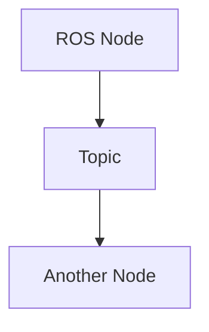

# Quickstart Guide: Docusaurus Documentation Site for Physical AI & Humanoid Robotics Book

## Prerequisites
- Node.js (v18 or higher)
- npm or yarn package manager
- Git

## Installation Steps

### 1. Clone the Repository
```bash
git clone [repository-url]
cd [repository-name]
```

### 2. Install Dependencies
```bash
cd website
npm install
```

### 3. Start Local Development Server
```bash
npm run start
```
This will start a local development server at http://localhost:3000

### 4. Build for Production
```bash
npm run build
```
This creates a static build in the `build/` directory

### 5. Deploy to GitHub Pages
The deployment happens automatically via GitHub Actions when changes are pushed to the main branch.

## Project Structure
```
website/                    # Docusaurus project root
├── docusaurus.config.ts    # Site configuration
├── sidebars.ts            # Navigation configuration
├── src/                   # Custom components and pages
│   ├── components/        # React components
│   ├── pages/            # Standalone pages
│   └── css/              # Custom styles
├── docs/                  # Documentation content
│   ├── index.md          # Introduction
│   ├── module-1/         # ROS 2 content
│   ├── module-2/         # Digital Twin content
│   ├── module-3/         # AI-Robot Brain content
│   ├── module-4/         # VLA content
│   └── capstone/         # Capstone project
└── static/               # Static assets
```

## Adding New Content
1. Create a new markdown file in the appropriate module directory
2. Add the file to `sidebars.ts` to make it appear in navigation (or ensure it's in a folder structure that will be auto-generated)
3. Use frontmatter to specify page metadata:
```markdown
---
title: Page Title
sidebar_position: 1
description: Description of the page
---
```

## Adding Code Examples
Use markdown code blocks with appropriate language identifiers:
```python
# Python/rclpy example
import rclpy
from rclpy.node import Node
```

```xml
<!-- URDF example -->
<robot name="humanoid">
  <link name="base_link"/>
</robot>
```

## Adding Mermaid Diagrams
Docusaurus supports Mermaid diagrams natively:


## Custom Styling
Custom CSS can be added in `src/css/custom.css` to implement the Sci-Fi/Robotics aesthetic.

## Troubleshooting
- If the site doesn't load properly, ensure all dependencies are installed with `npm install`
- For build errors, check that all markdown files have proper frontmatter
- For search issues, verify that the search plugin is properly configured in `docusaurus.config.ts`